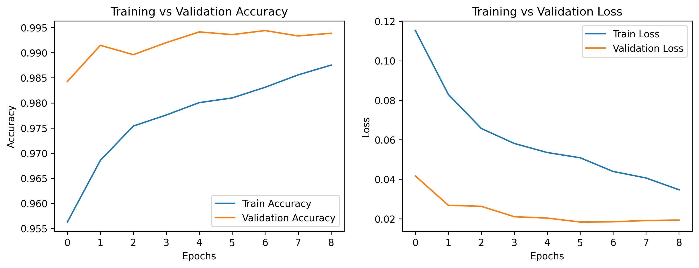

# Cats vs Dogs Image Classification using Transfer Learning

## 1. Problem Statement

The objective of this project is to build a high-performance image classification
model that can accurately distinguish between images of cats and dogs. Instead
of training a deep convolutional neural network (CNN) from scratch, the project
leverages transfer learning using a pre-trained CNN to achieve higher accuracy,
faster convergence, and better generalization.

This project demonstrates an end-to-end transfer learning workflow, including
data preparation, baseline comparison, feature extraction, fine-tuning, model
evaluation, and interpretability using Grad-CAM.

---

## 2. Dataset Description

**Dataset:** Dogs vs Cats (Microsoft Asirra)  
**Source:** Kaggle

The dataset consists of labeled RGB images of cats and dogs. The raw dataset was
manually organized into training, validation, and test sets to support proper
model evaluation.

**Data Split:**

- Training set: 70%
- Validation set: 15%
- Test set: 15%

**Directory Structure:**

```
data/
├── train/
│ ├── cats/
│ └── dogs/
├── val/
│ ├── cats/
│ └── dogs/
└── test/
├── cats/
└── dogs/
```

---

## 3. Project Folder Structure

cats-vs-dogs-transfer-learning/
│
├── data/ # Dataset (not committed to GitHub)
│
├── models/ # Saved model weights (.h5)
│ ├── baseline_cnn.h5
│ ├── mobilenetv2_phase1.h5
│ └── mobilenetv2_finetuned.h5
│
├── notebooks/ # Jupyter notebooks (step-by-step workflow)
│ ├── 01_data_exploration.ipynb
│ ├── 02_baseline_cnn.ipynb
│ ├── 03_transfer_learning_mobilenetv2.ipynb
│ ├── 04_fine_tuning.ipynb
│ ├── 05_evaluation_and_metrics.ipynb
│ └── 06_gradcam_visualization.ipynb
│
├── reports/ # Outputs and visualizations
│ ├── training_curves.png
│ ├── confusion_matrix.png
│ └── gradcam_examples/
│
├── src/ # Modular Python source code
│ ├── data_loader.py
│ ├── baseline_cnn.py
│ ├── transfer_model.py
│ ├── trainer.py
│ ├── evaluation.py
│ └── grad_cam.py
│
├── requirements.txt # Project dependencies
└── README.md # Project documentation

---

## 4. Model Choice and Justification

**Selected Model:** MobileNetV2

MobileNetV2 was chosen due to its:

- Computational efficiency on CPU systems
- Strong transfer learning performance on ImageNet
- Lightweight architecture suitable for limited hardware
- Proven effectiveness for binary image classification tasks

The pre-trained weights allow the model to reuse generic visual features such as
edges, textures, and shapes, significantly improving learning efficiency.

---

## 5. Two-Phase Training Strategy

### Phase 1: Feature Extraction

- The pre-trained MobileNetV2 backbone was frozen.
- Only the custom classification head was trained.
- Learning rate: 1e-3
- Purpose: Learn task-specific features without altering pre-trained weights.

### Phase 2: Fine-Tuning

- The top layers of the MobileNetV2 backbone were unfrozen.
- Lower layers remained frozen to prevent catastrophic forgetting.
- Learning rate: 1e-5
- Purpose: Fine-tune high-level features for improved accuracy and generalization.

This two-phase approach balances stability and adaptability.

---

## 6. Baseline vs Transfer Learning Comparison

A simple CNN was trained from scratch as a baseline model to quantify the benefits
of transfer learning.

| Model Type               | Accuracy |
| ------------------------ | -------- |
| Baseline CNN (Scratch)   | ~80–85%  |
| MobileNetV2 (Phase 1)    | ~98%     |
| MobileNetV2 (Fine-Tuned) | ~99%     |

The significant performance gap demonstrates the effectiveness of transfer
learning over training from scratch.

---

## 7. Evaluation Metrics

The final fine-tuned model was evaluated on a held-out test set using standard
classification metrics:

- Accuracy
- Precision
- Recall
- F1-score

A confusion matrix was also generated to analyze misclassification patterns.

All evaluation metrics were computed exclusively on the test set to ensure
unbiased performance assessment.

---

## 8. Training Visualization

Training and validation accuracy and loss curves are provided in:

### Training Curves



These curves show **stable convergence** and **minimal overfitting** during the fine-tuning phase.

---

## 9. Model Interpretability (Grad-CAM)

Grad-CAM was used to visualize the regions of input images that most strongly
influenced the model’s predictions.

The generated heatmaps demonstrate that the model focuses on **semantically
relevant regions**—such as the animal’s **face and body**—rather than background
artifacts.

Grad-CAM examples are available in:

```text
reports/gradcam_examples/


---

## 10. Reproducibility
All experiments were conducted in a reproducible Python environment defined in
`requirements.txt`. The codebase is modular, well-documented, and structured to
allow easy re-execution and extension.

---

## 11. Conclusion
This project demonstrates a complete and practical application of transfer
learning for image classification. By combining a strong pre-trained model,
careful fine-tuning, thorough evaluation, and interpretability techniques, the
final model achieves high accuracy while remaining efficient and explainable.


```
